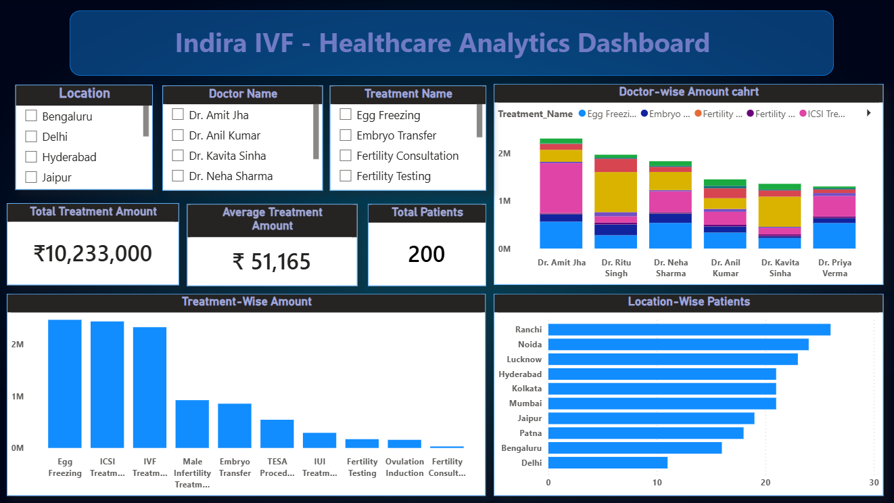

# Indira IVF - Healthcare Analytics Dashboard

An end-to-end healthcare data analytics project built using Excel, SQL, and Power BI to analyze patient, treatment, doctor, and location-level data.

## 📌 Project Overview

This project focuses on analyzing healthcare treatment data from Indira IVF. The analysis helps understand treatment performance, patient distribution, treatment costs, doctor-wise amounts, and location-wise patient counts.

The project follows a complete data analytics workflow:

**Data Preparation → SQL Analysis → Power BI Visualization**

## 🛠️ Tools & Technologies

- **Excel** – Data preparation and initial data handling
- **SQL** – Data analysis, aggregation, and business queries
- **Power BI** – Interactive dashboard and data visualization

## 📊 Dashboard Preview

## 📈 Key Analysis

The dashboard provides insights into:

- **Total Treatment Amount** – Overall amount generated from treatments
- **Average Treatment Amount** – Average treatment cost per patient
- **Total Patients** – Total number of patients in the dataset
- **Doctor-wise Treatment Amount** – Treatment amount generated by each doctor
- **Treatment-wise Amount** – Amount generated across different treatments
- **Location-wise Patients** – Patient distribution across different locations

## 🔍 Dashboard Features

- Location filter
- Doctor Name filter
- Treatment Name filter
- Doctor-wise treatment amount chart
- Treatment-wise amount analysis
- Location-wise patient distribution
- KPI cards for total amount, average amount, and total patients

## 🗄️ SQL Analysis

SQL queries were created to support the dashboard analysis, including:

- Total treatment amount
- Average treatment amount
- Total patient count
- Doctor-wise treatment amounts
- Treatment-wise amounts
- Location-wise patient counts

All SQL queries used for the analysis are available in the **SQL** folder.

## 📁 Project Files

| File | Description |
|---|---|
| `Indira_IVF_Dataset.csv` | Healthcare dataset used for analysis |
| `Indira_IVF_Healthcare_Dashboard.pbix` | Power BI dashboard file |
| `Indira_IVF_Dashboard.png` | Dashboard preview image |
| `SQL/` | SQL queries used for analysis |

## 🎯 Project Objective

The objective of this project is to demonstrate an end-to-end data analytics workflow and transform raw healthcare data into meaningful business insights using SQL and Power BI.

## 💡 Key Skills Demonstrated

- Data analysis
- SQL querying
- Data aggregation
- KPI creation
- Power BI dashboard development
- Data visualization
- Business insights generation
